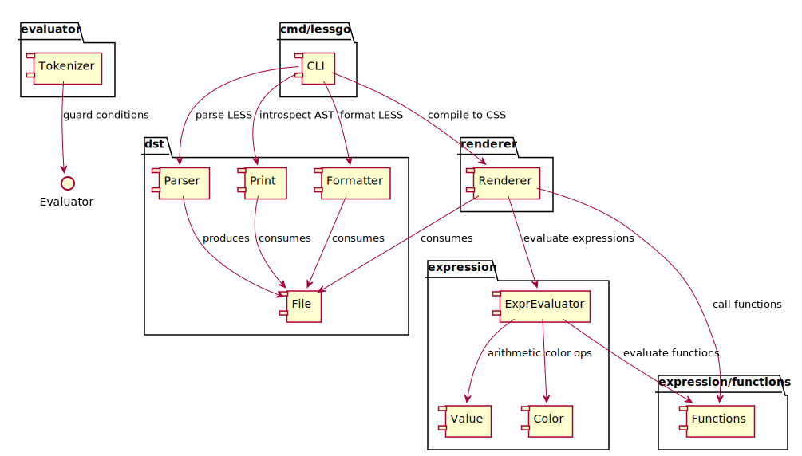

# lessgo

A comprehensive LESS to CSS compiler written in Go with a minimal DST (Decorated Syntax Tree) parser, formatter, and renderer. Compiles 65/65 fixture tests with 100% compatibility with `lessc`.

## Quick Start

### Installation

The package:

```bash
go get github.com/titpetric/lessgo
```

The CLI:

```bash
go install github.com/titpetric/lessgo/cmd/lessgo@latest
```

### Middleware (Recommended)

Use as HTTP middleware for on-the-fly LESS compilation:

```go
import (
	"os"
	"github.com/titpetric/lessgo"
)

middleware := lessgo.NewMiddleware("/assets/css", os.DirFS("assets/css"))
```

Requests to `/assets/css/style.less` are automatically compiled to CSS when wrapped around your handler.

### Custom HTTP Handler

For more control, create a handler:

```go
import (
	"os"
	"github.com/titpetric/lessgo"
)

handler := lessgo.NewHandler("/assets/css", os.DirFS("assets/css"))
```

See `examples/` for complete working implementations with tests.

## Benchmarks

Total compilation time (all fixtures, averaged across 10 runs):

- `lessc`: 12454ms (avg: 191ms per fixture)
- `lessgo`: 319ms (avg: 4ms per fixture)

The compilation in lessgo is 47.75x FASTER than lessc on average.

To run the benchmarks run `task build` and `./scripts/benchmark_with_lessc.sh`.

## CLI Usage

### Build

```bash
go build -o bin/lessgo ./cmd/lessgo
```

### Format LESS (`fmt` command)

Format LESS files with consistent indentation, expand inline blocks, add missing semicolons:

```bash
# Output formatted LESS to stdout
./lessgo fmt style.less

# Format and write back to file
./lessgo fmt -w style.less

# Format multiple files
./lessgo fmt -w testdata/fixtures/*.less

# Example: Before and after
# Before: .button { color: red; padding: 10px }
# After:  .button {
#           color: red;
#           padding: 10px;
#         }
```

### Compile to CSS (`generate` command)

Compile LESS to CSS with full feature support (variables, mixins, functions, nesting, etc):

```bash
# Compile single file to stdout
./lessgo generate style.less

# Compile to output file
./lessgo generate style.less -o style.css

# Compile with glob pattern
./lessgo generate 'styles/**/*.less' -o all.css

# Example usage in build pipeline
./lessgo generate 'src/**/*.less' -o dist/app.css
```

### Inspect AST (`ast` command)

Debug LESS parsing by inspecting the Abstract Syntax Tree:

```bash
# Print AST structure for a file
./lessgo ast style.less

# Example output:
# Block: selectors=[".button"] (mixin)
#   Var: @padding = 10px
#   Decl: color = red
#   Block: selectors=["&:hover"]
#     Decl: background = darkred
```

## Architecture



### Package Responsibilities

| Package                 | Purpose               | Key Types                                           | Responsibility                                                                                    |
|-------------------------|-----------------------|-----------------------------------------------------|---------------------------------------------------------------------------------------------------|
| `dst/`                  | Data Structure Tree   | `File`, `Node`, `Block`, `Decl`, `Comment`, `Stack` | Parse LESS files into AST, provide node interfaces, manage variable scope                         |
| `renderer/`             | CSS Code Generation   | `Renderer`                                          | Traverse AST, evaluate expressions, generate CSS output with proper nesting/selectors             |
| `expression/`           | Expression Evaluation | `Evaluator`, `Value`, `Color`                       | Parse and evaluate numeric/color expressions, handle arithmetic with units, variable substitution |
| `expression/functions/` | Built-in Functions    | Math, Color, String, List, Type, Logical            | Implement 40+ LESS functions (lighten, ceil, rgb, etc)                                            |
| `evaluator/`            | Guard Conditions      | `Tokenizer`                                         | Tokenize and evaluate mixin guard conditions (@media, comparison operators)                       |
| `cmd/lessgo/`           | CLI Tool              | Commands: `ast`, `fmt`, `generate`                  | Entry point for parsing, formatting, and compiling LESS files                                     |

### Data Flow

1. **Parse** (`cmd/lessgo fmt` / `generate`)
   - `Parser` reads `.less` file
   - Creates `File` AST with `Node` hierarchy
   - Builds `VarStack` for scoped variables

2. **Generate** (`cmd/lessgo generate`)
   - `Renderer` traverses AST depth-first
   - `ExprEvaluator` evaluates variable substitutions and expressions
   - `Functions` package applies LESS functions (color ops, math, etc)
   - Outputs CSS with resolved selectors and values

3. **Format** (`cmd/lessgo fmt`)
   - `Formatter` traverses AST and outputs LESS source
   - Adds missing semicolons to declarations
   - Expands inline blocks (one property per line)
   - Proper 2-space indentation
   - Blank lines between top-level definitions

## Features

### Core LESS Features
- **Variables** - Block-scoped variable definitions and interpolation
- **Nesting** - Nested selectors with automatic parent reference resolution
- **Parent Selector** - `&` reference in nested contexts
- **Operations** - Arithmetic operations (`+`, `-`, `*`, `/`) with unit handling
- **Comments** - Single-line (`//`) and multi-line (`/* */`) comments
- **@import** - Import other LESS files

### Functions
- **Math Functions** - `ceil()`, `floor()`, `round()`, `abs()`, `sqrt()`, `pow()`, `min()`, `max()`, `sin()`, `cos()`, `tan()`, `asin()`, `acos()`, `atan()`, `pi()`, `mod()`, `log()`, `exp()`, `percentage()`
- **Color Functions** - `rgb()`, `rgba()`, `hsl()`, `hsla()`, `hsv()`, `hsva()`, `hex colors`
- **Color Operations** - `lighten()`, `darken()`, `saturate()`, `desaturate()`, `fade()`, `spin()`, `mix()`, `greyscale()`, `multiply()`, `overlay()`, `difference()`
- **Color Channels** - `hue()`, `saturation()`, `lightness()`, `hsv()`, `red()`, `green()`, `blue()`, `alpha()`, `luma()`
- **Type Functions** - `isnumber()`, `isstring()`, `iscolor()`, `iskeyword()`, `isurl()`, `ispixel()`, `isem()`, `ispercentage()`, `isunit()`, `isgradient()`, `isdefined()`
- **String Functions** - `escape()`, `e()`, `format()`, `replace()`, `length()`, `extract()`
- **List Functions** - `range()`, `length()`, `extract()`, `each()`
- **Logical Functions** - `boolean()`, `if()`, `luma()`
- **Misc Functions** - `unit()`, `get-unit()`, `convert()`, `color()`

### Mixins & Extends
- **Basic Mixins** - Define and invoke mixins with parameters
- **Parametric Mixins** - Support default parameters and multiple arities
- **Mixin Guards** - Conditional mixin application with comparison operators
- **Pattern Matching** - Arity-based mixin overloading
- **Mixin Namespace** - Nested mixin definitions via `#namespace > .mixin()`
- **Extends** - `&:extend()` selector composition and multiple extends

### Advanced Features
- **Detached Rulesets** - Block variables (`@var: { ... }`) and invocation
- **Maps** - Namespace blocks used as maps
- **Nested @media** - Media queries bubble to top level with selector context
- **CSS3 Variables** - `--var` custom properties (pass-through)

## Development

See AGENTS.md for development workflow and package organization details. See FEATURES.md for complete feature checklist.
